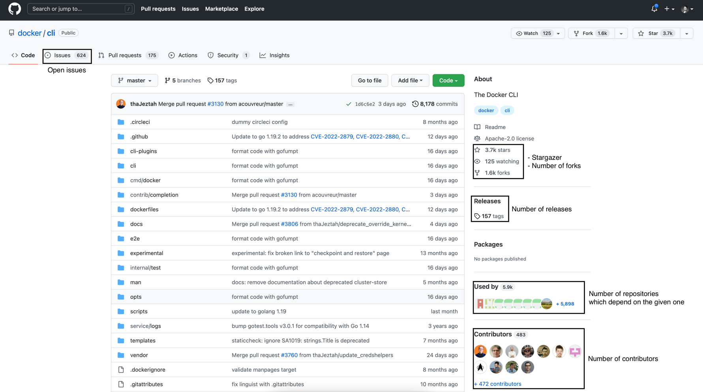

# Analysis of public Go modules from GitHub

**The objective**: to build a database of the public Go modules and perform inter-modules dependencies analysis.

## Execution path

1. [List the modules for analysis](#list-modules)
2. [Fetch raw data](#fetch-raw-data) for each module 
3. [Extract raw data](#extract-raw-data)
4. Build the graph db
5. Aggregate the data: 
   1. Go version 2D distribution as the function of:
      - repo age 
      - months since last update 
   2. Number of dependencies distribution
   3. Number of releases as the function of repo age
   4. Number of contributors as the function of repo age
   5. Stargazer (number of stars) as the function of:
      - repo age
      - months since last update
      - number contributors
      - number dependencies
      - number of repos depending on it
   6. Number of forks as the function of:
      - repo age
      - months since last update
      - number contributors
      - number dependencies
      - number of repos depending on it
6. Deploy dataviz dashboard as a webpage

### List modules

The search functionality is used to list the Go modules across all public GitHub repositories.

_The query_:
```html
https://github.com/search?o=desc&q=module+extension%3Amod+language%3AText&s=indexed&type=Code
```

_The tool_: [application codebase](./app/cmd/listmodules)

_Raw data_: see [here](./data/list/2022/10/16/html/)

### Fetch raw data

Data extraction used for research is within the [p.7](https://docs.github.com/en/site-policy/acceptable-use-policies/github-acceptable-use-policies#7-information-usage-restrictions) of the GitHub Acceptable Use Policies.

#### Download Go module dependencies file 

The GitHub content endpoint `https://raw.githubusercontent.com/` is used to the download the module dependencies list, i.e. the `go.mod`, or `vendor.mod` file.

#### Go module repository metadata

_Table1. Options to gather the data_

| Option                                               | Pro                           | Contra                                                                                                                                                 |
|------------------------------------------------------|-------------------------------|--------------------------------------------------------------------------------------------------------------------------------------------------------|
| Scrape repository web-page                           | - All metadata in one request | - No SLA on API contract (a.k.a. "hacky approach")                                                                                                     |
| [GitHub GraphQL](https://docs.github.com/en/graphql) | - Versioned API contract      | - [API quota](https://docs.github.com/en/rest/rate-limit) of 5000 requests per hour                                                                    |
| [GitHub API](https://docs.github.com/en/rest)        | - Versioned API contract      | - [API quota](https://docs.github.com/en/rest/rate-limit) of 5000 requests per hour<br/>- Several endpoints shall be called to fetch required metadata |

_Table2. Metadata attributes availability_

| Attribute                                            |  Scrapping  | GraphQL | API |
|------------------------------------------------------|:-----------:|:-------:|:---:|
| creation date                                        |      -      |    +    |  +  |
| date of last update                                  |      -      |    +    |  +  |
| stargazer count                                      |      +      |    +    |  +  |
| forks count                                          |      +      |    +    |  +  |
| contributors count                                   |      +      |    +    |  -  |
| number of open issues                                |      +      |    +    |  +  |
| number of tags                                       |      +      |    +    |  -  |

Use of the GitHub GraphQL is the most viable option based on the assessment above despite the 5000 requests per hour limitation. 

### Extract raw data

#### Module meta from the dependencies list

- Required Go version, see [the example](https://github.com/docker/cli/blob/1d6c6e2367e292950e483e3c8ace142792bca718/vendor.mod#L7)
- Direct requirements, see [the example](https://github.com/docker/cli/blob/1d6c6e2367e292950e483e3c8ace142792bca718/vendor.mod#L9-L44)

#### Repository metadata from the html page

**_Example_**



#### Repository metadata extraction using GitHub GraphQL

```graphql
query RepositoryInfo($org: String!, $repo: String!) {
   repository(name: $repo, owner: $org) {
      createdAt
      updatedAt
      stargazerCount
      forkCount
      openIssues: issues(states: OPEN) {
         totalCount
      }
      contributors: mentionableUsers {
         totalCount
      }
      tags: refs(refPrefix: "refs/tags/") {
         totalCount
      }
   }
}
```

**_Example_**

Input:
```json
{
   "org": "docker", 
   "repo": "cli"
}
```

Result:
```json
{
   "data": {
      "repository": {
         "createdAt": "2017-04-12T05:27:42Z",
         "updatedAt": "2022-10-15T17:37:04Z",
         "stargazerCount": 3660,
         "forkCount": 1573,
         "openIssues": {
            "totalCount": 624
         },
         "contributors": {
            "totalCount": 503
         },
         "tags": {
            "totalCount": 157
         }
      }
   }
}
```
