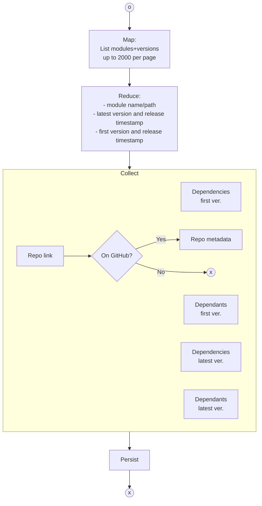

# Analysis of public Go modules from GitHub

**The objective**: to build a database of the public Go modules and perform inter-modules dependencies analysis.

## Execution path

1. [Extract data](#data-extraction)
2. Build the graph db
3. Aggregate the data: 
   1. Go version 2D distribution as the function of:
      - repo age
      - months since last update 
   2. Number of dependencies distribution
   3. Number of releases as the function of repo age
   4. Number of contributors as the function of repo age
   5. Stargazer (number of stars) as the function of:
      - repo age
      - months since last update
      - number contributors
      - number dependencies
      - number of repos depending on it
   6. Number of forks as the function of:
      - repo age
      - months since last update
      - number contributors
      - number dependencies
      - number of repos depending on it
4. Deploy dataviz dashboard as a webpage

## Data extraction

### Index modules

The [Go module index](https://index.golang.org/) is used to list modules for analysis.

_The tool_: [application codebase](./app/cmd/indexmodules/main.go)
