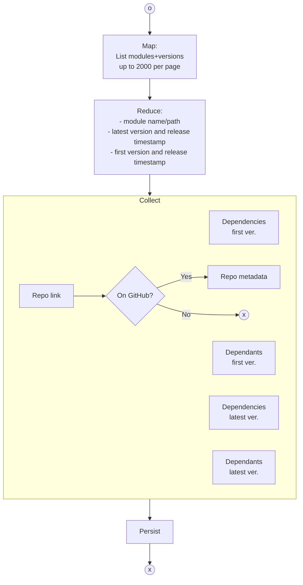

# Analysis of public Go packages

## The objective

1. To _build_ a database of public Go packages and to perform inter-modules dependencies analysis;
2. To _compile_ a basis to facilitate the process of picking dependencies right for the product.

### The context 

How many times have you been making decisions about dependencies for software to solve the business problem _X_ at _Y_ delivery and _Z_ maintenance effort? 

Each time, you would stumble upon three questions:

- How to maximize benefits and minimize risks associated with the decision you make?
- What shall the decision be based upon?
- What shall make you to pick A instead of B even though both deliver the functionality you need?  

All software engineers and managers ask those questions at some point. None of them however would have "the ultimate right answer". 

My **idea for the project** is, to "_let data speak_" in order to understand how (if possible) to define a set of steps to follow to facilitate decision-making process when picking dependencies for your product.       

## Execution path

1. [Extract data](#data-extraction)
2. Build the graph db
3. Aggregate the data: 
   1. Go version 2D distribution as the function of:
      - repo age
      - months since last update 
   2. Number of dependencies distribution
   3. Number of releases as the function of repo age
   4. Number of contributors as the function of repo age
   5. Stargazer (number of stars) as the function of:
      - repo age
      - months since last update
      - number contributors
      - number dependencies
      - number of repos depending on it
   6. Number of forks as the function of:
      - repo age
      - months since last update
      - number contributors
      - number dependencies
      - number of repos depending on it
4. Deploy dataviz dashboard as a webpage

## Data extraction

### Index modules

The [Go module index](https://index.golang.org/) is used to list modules for analysis.

_The tool_: [application codebase](./app/indexmodules)
